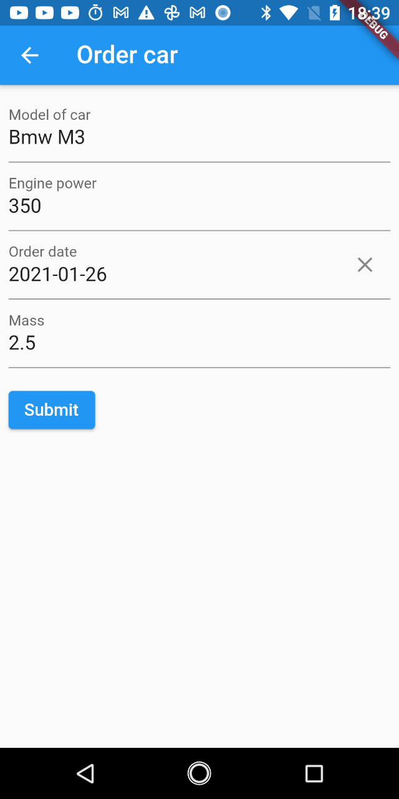

# uform_generator

Flutter form generator from obect model and annotations.

### Install package
Add some rows to `pubspec.yaml`:

```yaml
dependencies:
  uform_generator:
    path: ../ # Path to uform generator

dev_dependencies:
  build_runner: ^1.10.13 
```


### Usage

Flutter forms have some boilerplate code. This project is an attempt to simplify creating source code of forms.
All necessary form properties can be represented as an object model with annotations and validators.

Now support next types of properties:
- String
- int
- double
- DateTime

Let's look at a simple form for ordering a new car:



This form may describe by next model:

```dart
@UForm()
class CarForm {
  @UFormField(validator: 'validatorNotEmpty', fieldName: 'Model of car')
  final String name;

  @UFormField(validator: 'validatorNoZero', fieldName: 'Engine power')
  final int power;

  @UFormField(validator: 'validatorDate', fieldName: 'Order date')
  final DateTime orderDate;

  @UFormField(validator: 'validatorNoZero', fieldName: 'Mass')
  final double mass;

  CarForm(this.name, this.power, this.orderDate, this.mass);
}
```

Annotations `UForm` and `UFormField` help the generator to build form code.
User input needs to be validated. Create some validators in same file:

```dart
FormFieldValidator<String> validatorNotEmpty = (value) {
  if (value.isEmpty) {
    return 'Please enter some text';
  }
  return null;
};

FormFieldValidator<String> validatorNoZero = (value) {
  final parsedDigit = num.tryParse(value);

  if (parsedDigit == null) {
    return 'Parsing error!';
  }

  if (parsedDigit <= 0) {
    return 'Value must be more than 0!';
  }

  return null;
};

FormFieldValidator<DateTime> validatorDate = (value) {
  if (value == null) {
    return "Value must not be a null!";
  }

  if (value.isBefore(DateTime(2001, 10, 10))) {
    return 'Low date!';
  }

  return null;
};


```
Since the generator needs to specify the path to the file with the generated code, let's write in front of our form model:

```dart
part 'car_form.g.dart';
```

Then run command:
```
flutter pub run build_runner build
```

Build runner should build next code for form:
```dart
// GENERATED CODE - DO NOT MODIFY BY HAND

part of 'car_form.dart';

// **************************************************************************
// FormGenerator
// **************************************************************************

class CarFormForm extends StatefulWidget {
  final CarForm formModel;
  final Function(CarForm carForm) callback;

  CarFormForm({Key key, this.formModel, this.callback}) : super(key: key);

  @override
  _CarFormFormState createState() => _CarFormFormState();
}

class _CarFormFormState extends State<CarFormForm> {
  final _formKey = GlobalKey<FormState>();
  final format = DateFormat("yyyy-MM-dd");

  TextEditingController _nameTextEditingController;
  TextEditingController _powerTextEditingController;
  TextEditingController _orderDateTextEditingController;
  TextEditingController _massTextEditingController;

  @override
  void initState() {
    super.initState();

    _nameTextEditingController =
        TextEditingController(text: widget.formModel.name);
    _powerTextEditingController =
        TextEditingController(text: widget.formModel.power.toString());
    _orderDateTextEditingController =
        TextEditingController(text: format.format(widget.formModel.orderDate));
    _massTextEditingController =
        TextEditingController(text: widget.formModel.mass.toString());
  }

  @override
  Widget build(BuildContext context) {
    return Form(
      key: _formKey,
      child: Column(
        crossAxisAlignment: CrossAxisAlignment.start,
        children: <Widget>[
          TextFormField(
            controller: _nameTextEditingController,
            decoration: const InputDecoration(
              labelText: 'Model of car',
            ),
            validator: validatorNotEmpty,
          ),
          TextFormField(
            controller: _powerTextEditingController,
            decoration: const InputDecoration(
              labelText: 'Engine power',
            ),
            inputFormatters: [
              FilteringTextInputFormatter.allow(RegExp('^-?(\\d+)?'))
            ],
            keyboardType: TextInputType.number,
            validator: validatorNoZero,
          ),
          DateTimeField(
            format: format,
            controller: _orderDateTextEditingController,
            initialValue: widget.formModel.orderDate,
            decoration: const InputDecoration(
              labelText: 'Order date',
            ),
            validator: validatorDate,
            onShowPicker: (context, currentValue) {
              return showDatePicker(
                  context: context,
                  firstDate: DateTime(1900),
                  initialDate: currentValue ?? DateTime.now(),
                  lastDate: DateTime(2100));
            },
          ),
          TextFormField(
            controller: _massTextEditingController,
            decoration: const InputDecoration(
              labelText: 'Mass',
            ),
            inputFormatters: [
              FilteringTextInputFormatter.allow(
                  RegExp('^-?(\\d+(\\.|,)?\\d*)?'))
            ],
            keyboardType: TextInputType.number,
            validator: validatorNoZero,
          ),
          Padding(
            padding: const EdgeInsets.symmetric(vertical: 16.0),
            child: ElevatedButton(
              onPressed: () {
                if (_formKey.currentState.validate()) {
                  final newFormModel = CarForm(
                      _nameTextEditingController.value.text,
                      int.parse(_powerTextEditingController.value.text),
                      format.parse(_orderDateTextEditingController.value.text),
                      double.parse(_massTextEditingController.value.text));

                  widget.callback(newFormModel);
                }
              },
              child: Text('Submit'),
            ),
          ),
        ],
      ),
    );
  }
}

```